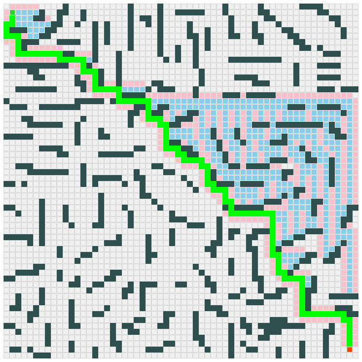

# Shortest Path Algorithm ( A\* )

## Live Demo [Click Me !!](https://thenirmalkc.github.io/maze-generator/)

## A star ( A* )

A* is an **informed search algorithm** (i.e. having information of goal node -> its location ), it aims to find a path to the given goal node. It does this by maintaining a tree of paths originating at the start node and extending those paths one edge at a time until its termination criterion is satisfied.

## For Shortest Path

A* needs to determine which of its paths to extend. It does so based on the cost of the path and an estimate of the cost required to extend the path all the way to the goal. Specifically, A* selects the path that minimizes

**_f(n) = g(n) + h(n)_**

where,\
  **n** -> the next node on the path.\
  **g(n)** -> is the cost of the path from the start node to **n**.\
  **h(n)** -> is a heuristic function that estimates the cost of the cheapest path from n to the goal.\
  **f(n)** -> is the sum of **g(n)** and **h(n)**.\
  
## Implementation
